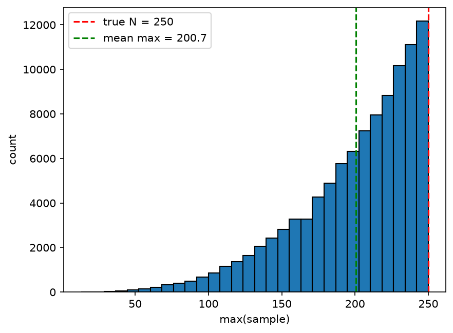
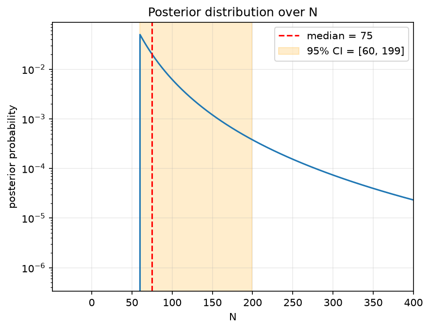

# The German Tank Problem — Notes

**Setup:** captured serials `19, 40, 42, 60` (k=4), assumed to be a uniform random sample without replacement from `1..N`. Goal: estimate N.

## Frequentist estimators

| Estimator | Formula | Property |
|---|---|---|
| Raw max | `max` | **biased low** |
| Method of moments | `2·mean − 1` | unbiased |
| Gap-corrected | `max + max/k − 1` | **unbiased, minimum variance** |

**Why max is biased low:** max ≤ N always, so it can never overshoot — by construction the sampling distribution is squeezed below N. In fact `E[max] = N·k/(k+1)`, which rearranges to the gap-corrected estimator above (plus a `−1` discreteness correction, verified exactly on a toy N=2, k=1 case).

  

**Contest** (true N=250, k=4, 100,000 simulated captures):

| Estimator | Bias | RMSE |
|---|---|---|
| max | −49.09 | 63.59 |
| gaps | 0.13 | **50.53** |
| moments | −0.07 | 71.59 |

Both `gaps` and `moments` are unbiased, but `gaps` has noticeably lower RMSE — it's the **minimum-variance unbiased estimator**.

**Why gaps beats moments, despite using less of the data:** `max` is a *sufficient statistic* for N here — the likelihood of the data depends on N and max(sample) only. Every value below the max carries no further information about *where the boundary is*; averaging them in (as `moments` does) just adds noise. It's the difference between estimating a center (mean is great) and estimating a boundary (only the closest point to the edge matters).

**Applied to the real data:** max=60, k=4 → **N̂ = 74**.

## Bayesian extension

- **Prior:** uniform over N = 1..1000.
- **Likelihood:** P(data | N) = 1 / C(N, k) for N ≥ max(data), else 0 — every k-subset of `1..N` is equally likely, so the probability of drawing this *specific* subset is one over the count of subsets.
- **Posterior:** prior × likelihood, renormalized over the grid.

Result: **posterior median = 75**, **95% credible interval = [60, 199]**.

  

The posterior is asymmetric: it has a hard floor at N=60 (can't be less than the observed max) and a long right tail (C(N,k) grows with N, so larger N is always possible, just increasingly unlikely). The posterior *mode* is actually 60 (likelihood is maximized at the smallest permissible N), while the *median* is pulled up to 75 by the tail — same asymmetry that makes the mean sensitive to skew.

## Two methods, one answer

The frequentist point estimate (74) and the Bayesian posterior median (75) land almost exactly together — reassuring agreement between two very different philosophies. The Bayesian approach adds the credible interval, giving an honest picture of how much uncertainty 4 data points actually leaves.

## Conclusion (with caveats)

Given these four serials, N≈250 sits well outside the 95% credible interval — it's quite improbable *if* the model's assumptions hold:

- serials are numbered sequentially from 1
- the captured tanks are a uniform random sample (no bias toward low or high serials)

Under those assumptions, the data suggest the Germans had produced well under 200 tanks at the time of capture — the real historical punchline of this problem: this method's estimates tracked actual wartime production records far more closely than conventional intelligence estimates did.
